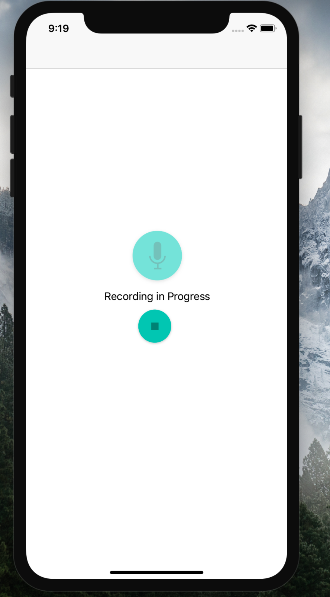
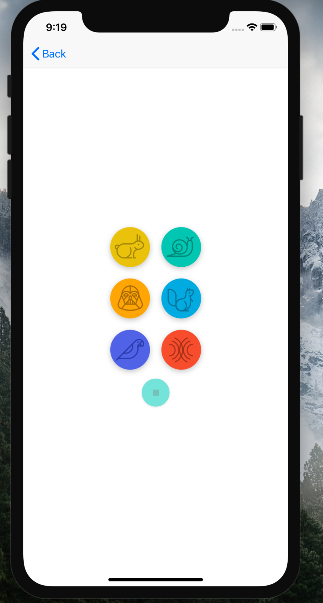
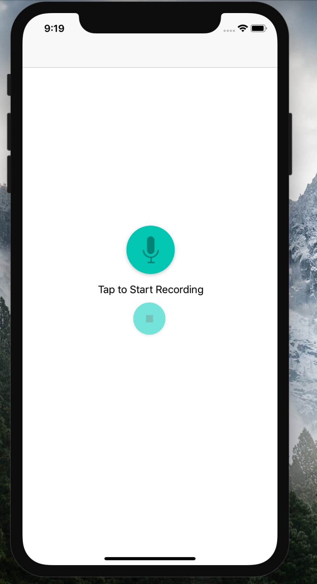

# Pitch Perfect

## Prerequisites
- IOS Running Device
- Simulator on MacOS
- Xcode 9.0 and Above
- Swift 4

## Theory
- This App is a Public ChatRoom App where Users Sign in after registering using their Email IDs and could chat with people all across Globe.
- It uses Firebase for Networking and Database Support.

## How To Run It
- Download this Project on your Mac
- Open This Project Folder
- Open the Pitch Perfect.xcodeproj
- Just Build It and Run it

#### Following are some of the screenshots of the application : 
- 
- 
- 
- 

